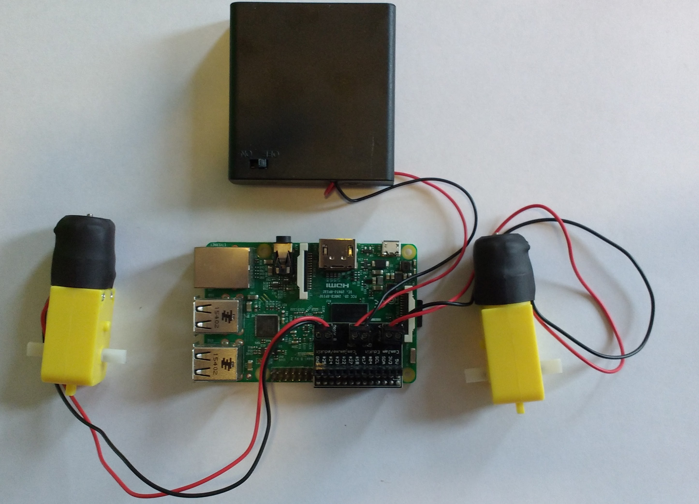

# Driving Motors

In this resource, you will learn how to build a robot buggy, that can drive autonomously (on it's own) or be remote controlled using a games console controller.

## Driving Motors with a Raspberry Pi

Your robot buggy is going to need a pair of motors, so that it can drive forwards, backwards and turn around.
Unlike many other components, the Raspberry Pi is unable to drive motors straight from the GPIO pins. This is because motors draw too much power when they start up, and also becuase when they slow down they can act as generators force power back to the GPIO pin, which could damage the circuitry.
For this reason you need to use an Motor Driver chip. These can be standalone chips that fit on a breadboard, or they can be mounted on a HAT that will sit on the Raspberry Pi.
Some motor controller chips can use the Raspberry Pi as a power supply. Others require an external source of power, such as a battery pack.

## Connecting your Motor Controller Board

1. Take your motor controller board, and using a small screwdriver, loosen the screws in each of the three terminal blocks.

1. The motors can be connected into their terminal blocks anyway around, and the screws then tightened so that they are held securely in place.

1. The battery pack *must* be connected so that the red wire goes into port labeled UTN. The black wire goes into the port labeled GND. Make sure the battery pack is turned off as you do this.

	

1. The style of motor controller board used in this project can sit directly onto the Raspberry Pi GPIO header pins, and uses pins 7, 8, 9 and 10. With motors and power connected, and your Raspberry Pi switched off, you can place the board over the pins of your Raspberry Pi as shown below.

	

1. You can now power your Raspberry Pi up.

## Controlling the Motors.

1. The next step is to test that your motors work and that you can control them. For this you'll need a few lines of Python code. Open up IDLE, by clicking on `Menu` > `Programming` > `Python 3 (IDLE)`. Then click on `File` > `New File` to create a new Python script. You can save it straight away, calling it something like `robot.py`.

1. The gpiozero module contains a class for robots, that makes it very easy to use motor controller boards. You just have to tell it which pins the board is using. Start by importing the `Robot` class and then giving your robot a name, and setting the pin numbers.

```python
from gpiozero import Robot
remy = Robot(left = (7, 8), right = (9, 10))
```

	If you are using a different board, make sure that you use the correct pin numbers for the board you are using.

1. Save an run your code, then using the shell you can control your motors, and test they are working, using the following commands:

	```python
	>>> ## drive both motors forward
	>>> remy.forward()
	>>> ## drive both motors backwards
	>>> remy.backwards()
	>>> ## Drive the left motor forwards and the right motor backwards
	>>> remy.right()
	>>> ## Drive the right motor forwards and the left motor backwards
	>>> remy.left()
	>>> ## Stop both motord
	>>> remy.stop()
	```
	
1. You can find out which way the motors will need to be in your buggy, by driving them both forwards and then noting which way the axels turn.

1. If they are driving in different diections, you can always change the order the pin numbers are provided to the `Robot` class. For instance, this will swap the direction that the `right` motor goes.

	```python
	from gpiozero import Robot
	remy = Robot(left = (7, 8), right = (10, 9))
	```
1. Next use the `remy.right()` command, and see which motor changes direction. The motor that changes direction will be the right motor, as it will start spinning backwards.

1. You can add labels to your motors to indicate which is left and right, and which way is forward.


## What Next?

You now have enough to make a primitive robot buggy. If that is as far as you want to go, then you can move onto the section about building a chasis for your robot. Below are some other worksheets to show you how to set up an ultrasonic sensor, a line sensor and a Wiimote to give greater control of your robot.

1. Using an ultrasonic sensor to detect obstacles
1. Using a line sensor to follow lines
1. Building a chasis for your robot
1. Programming your buggy to avoid obstacles
1. Programming your buggy to follow a line
1. Programming yout buggy to use a Wiimote
1. Programming your buggy to do everything
