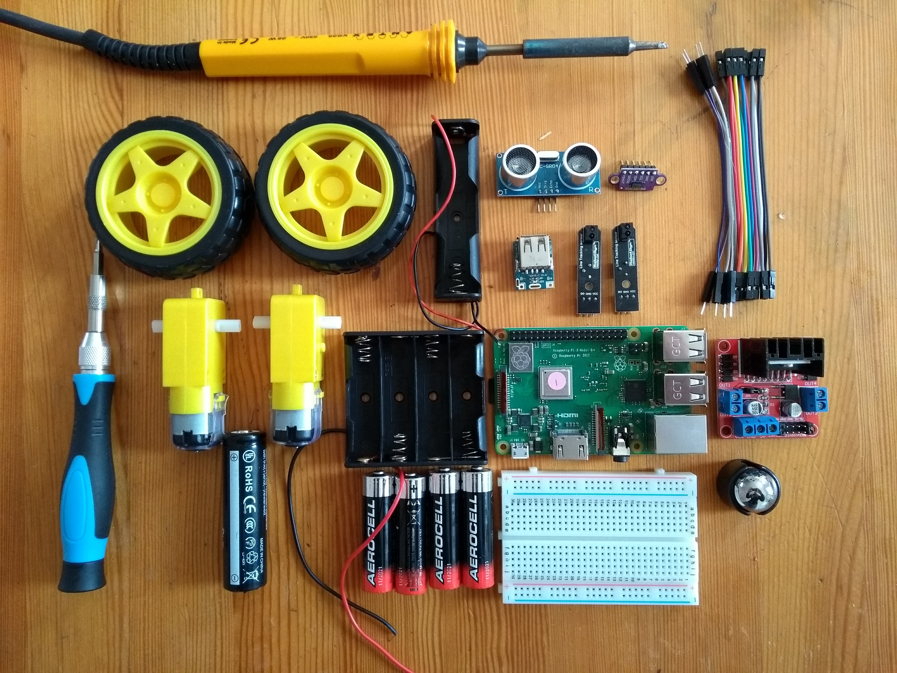

## Introduction

In this project you will build a robot buggy that you can program to move around using simple Python commands.

--- collapse ---
---
title: What you will learn
---
- How to set up a motor controller board with two motors
- How to control motors using Python
- How to build a robot chassis

This resource covers elements from the following strands of the [Raspberry Pi Digital Making Curriculum](https://www.raspberrypi.org/curriculum/):

- [Combine inputs and/or outputs to create projects or solve a problem](https://www.raspberrypi.org/curriculum/physical-computing/builder)
- [Use manufacturing techniques and tools to create prototypes](https://www.raspberrypi.org/curriculum/manufacture/builder)
--- /collapse ---

--- collapse ---
---
title: What you will need
---
- Note that not all of the following hardware is required to create the buggy. However, if you are planning to add autonomous capability (self-driving) to your robot buggy, then you will need additional bits in the 'optional' list.

### Hardware

#### Basic buggy
- Raspberry Pi 3
- Motor controller board
- 2 × 12V DC motors
- 2 × wheels
- 1 × AA battery holder (for 4 AA batteries)
- 4 × AA batteries
- Ball caster
- Wire or jumper leads
- A USB Battery pack
- Screw driver
- Soldering iron and solder
- Wire strippers
- Small cardboard or plastic box and glue/tape

#### Optional additional components
- Breadboard
- VL53L0X time-of-flight range finder or ultrasonic distance sensor
- 2 × line following sensors
- 18650 battery, battery clip, USB charge/discharge board (or USB power bank)
You can view all the required components on this [AliExpress Wish List](https://my.aliexpress.com/wishlist/shared.htm?groupId=100000000943756&shortkey=i6BnQZNJ&addresstype=600), but they can be ordered/bought anywhere, and alternatives are available.

### Software
- The latest version of the Raspbian operating system

### Additional extras
- Small cardboard box
- Adhesives (duct tape/putty/glue)

--- /collapse ---

