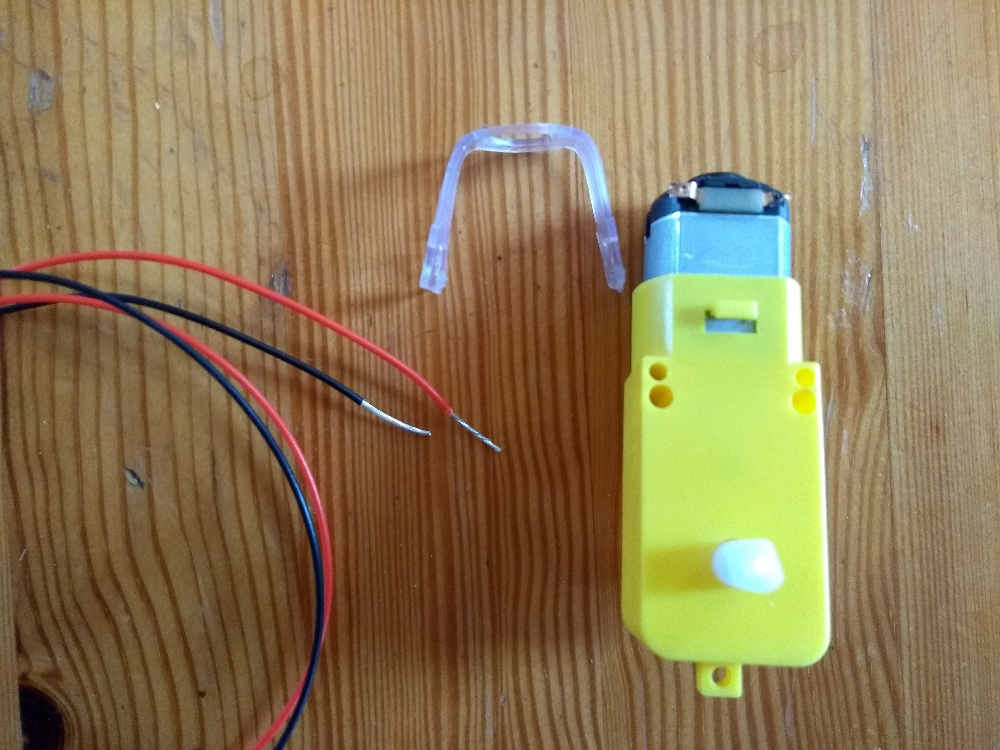
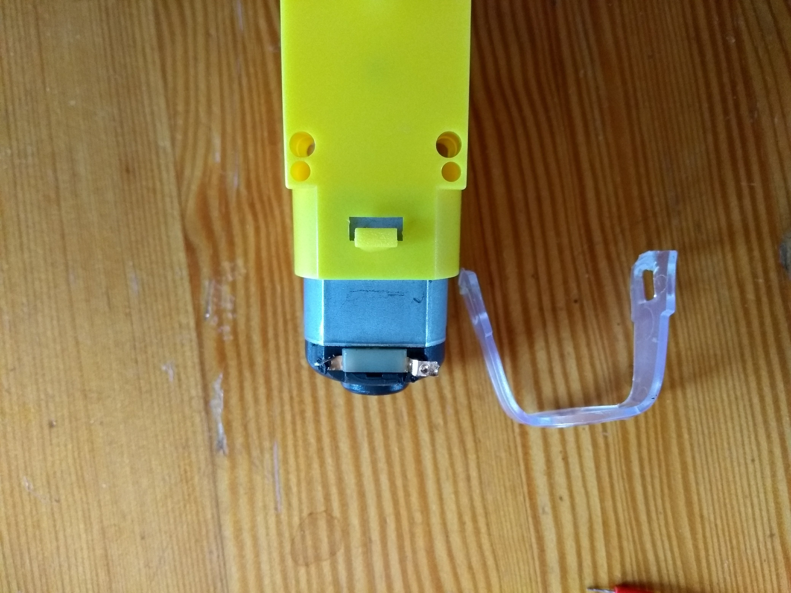
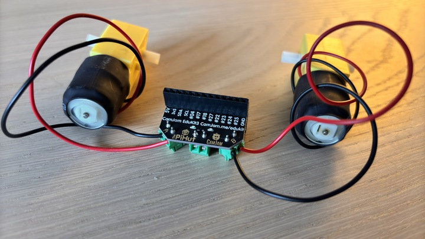
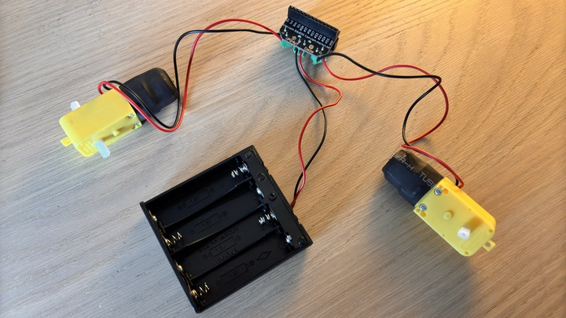
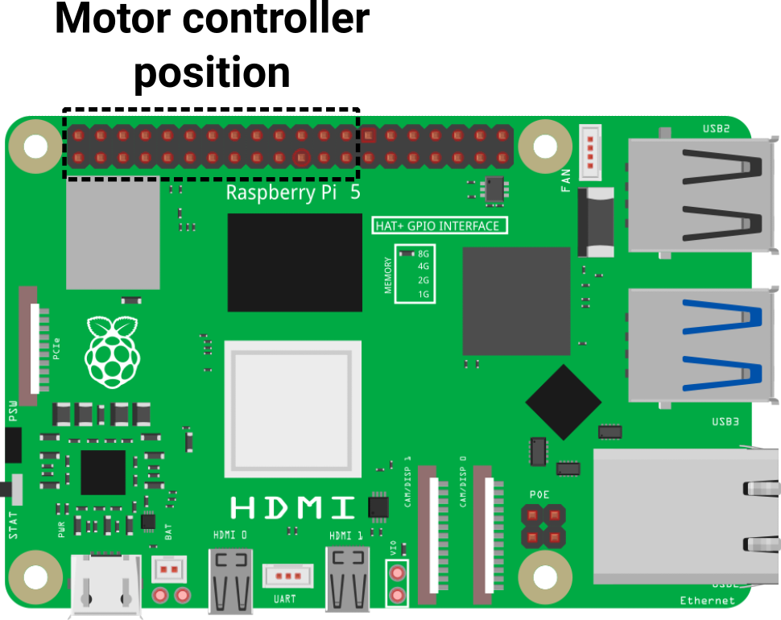
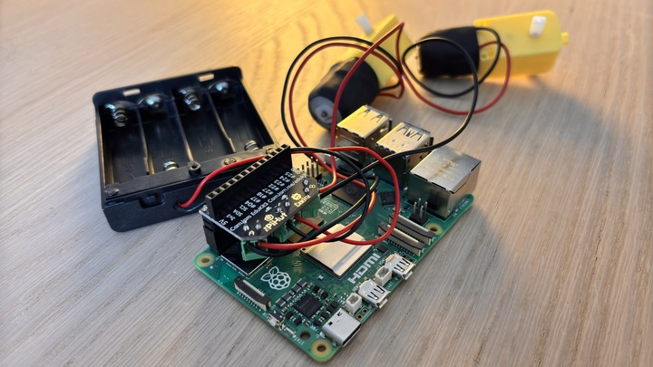

## Assembling the motors and board

You need to connect your motor controller board to your Raspberry Pi, the battery pack, and your two motors, to test that they are all working.

**Note**: The instructions here will be pretty similar for most motor controller boards. Check the documentation for your board if you are using a different one.

--- collapse ---

---
title: Wires not attached to your motors?
---

Some motors don't have wires attached, so you will need to solder these on. If you have never soldered before, then have a look at our [Getting started with soldering](https://projects.raspberrypi.org/en/projects/getting-started-with-soldering){:target="_blank"} resource.

+ Strip the ends of the wires to reveal the metal core.

	
+ Remove the plastic clip from the motor to make soldering to the contacts easier. You can do this with a screwdriver.

+ Solder the wires to each of the terminals on the motor. It doesn't matter which wire goes to which terminal. Then re-attach the plastic clips.

+ Trim the tips of the wires to ensure they do not touch the metal casing of the motor. You could also wrap the ends of the motors in electrical tape, to stop the soldered joints from breaking.

--- /collapse ---

### Connect the motors to the motor controller board

--- task ---

Using a small screwdriver, loosen the screws in the terminal blocks labelled **A** and **B**. 

**Note**: Have a look at the documentation for your board if your labels are different. 

Insert the stripped ends of wire into the terminal blocks and tighten the screws.

--- /task ---

### Powering the motors

The motors require more power than the Raspberry Pi can provide. Therefore, you will use four AA batteries to power them.

--- task ---
Loosen the screws in the terminal blocks labelled **+** and **-**. 

Take the AA battery holder and insert the red wire into the **+** terminal block. The black wire goes into the **-** block. It is important that you get this the correct way around.

Tighten the screws.

--- /task ---

--- task ---

### Connect the motor controller board to your Raspberry Pi

Push the motor controller board onto the first 26 GPIO pins of your Raspberry Pi.

The motor and power terminals should face the HDMI port(s).

--- /task ---
