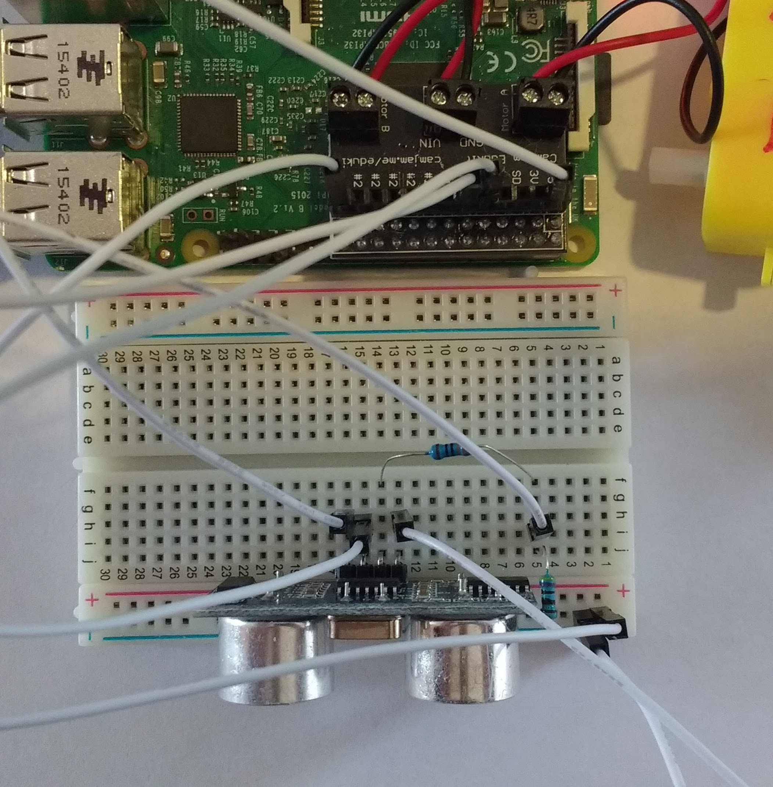

## Using an ultrasonic distance sensor

There is a [detailed guide](https://www.raspberrypi.org/learning/physical-computing-with-python/distance/) on how to use an Ultrasonic Distance Sensor on the Raspberry Pi website, so this section will focus on quickly connecting the Sensor and using it to detect objects that are close to it. This will allow your robot to move past obstacles that are in it's way.

## Connecting a Distance Sensor.

To start with, you can mount your Distance Sensor on a breadboard. Use a 330ohm and 470 ohm resistor to connect the pins to your Raspberry Pi.
In the example below, the breakout part of the Motor Controller Board has been used. The `echo` pin feeds into `GP17` and the `trig` pin feeds into `GP4`.



## Testing your Distance Sensor.

1. Open a new Python File to write a little code to test that your sensor is working. You'll need only two lines.

	```python
	from gpiozero import DistanceSensor
	dist = DistanceSensor(echo = 17, trigger = 4)
	```
1. If you've used different pins for yout Distance Sensor, make sure the code reflects these pins.

1. Save and run your code, then switch over into the shell. You can test the Distance Sensor by typing the following.

```python
>>> dist.value
```

1. The output you get back is the distance (from 0 to 1) that an obect is away from the sensor. Place an object infront of it and try typing `dist.value` again, to see the result.

## What Next?

You can now include the Ultrasonic Distance Sensor in your robot project. If that's as muchas you want to do, then you can build your robot's chasis and then start coding it to drive and avoid obstacles. Have a look at the links below to see where to go next.

1. Using an ultrasonic sensor to detect obstacles
1. Using a line sensor to follow lines
1. Building a chasis for your robot
1. Programming your buggy to avoid obstacles
1. Programming your buggy to follow a line
1. Programming yout buggy to use a Wiimote
1. Programming your buggy to do everything
