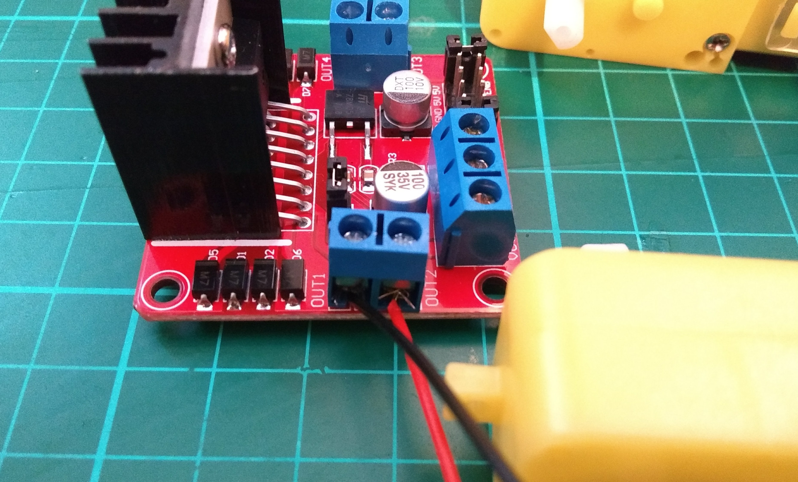
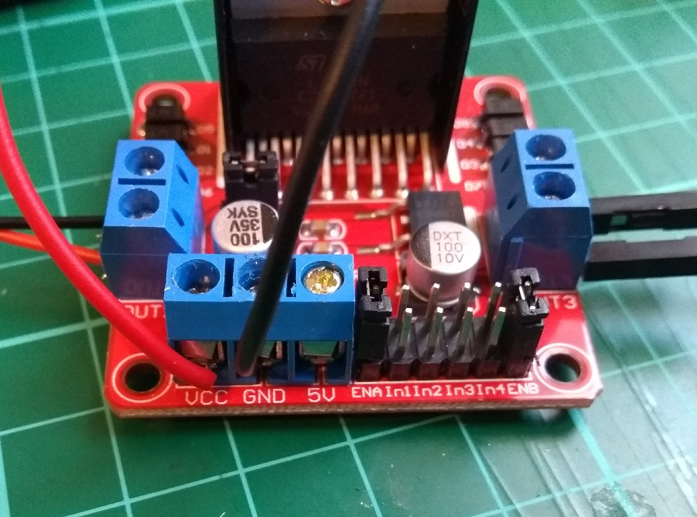

## Assembling the motors and board

The first thing you will want to do is to connect your motor controller board to your Raspberry Pi, the battery pack, and your two motors, to test that they are all working.

The instructions here are for L298N Dual H Bridge DC Stepper Motor Driver Controller Board, and they will be pretty similar for most motor controller boards. Check the documentation for your board if you are using a different one.

### Soldering wires to your motors

Most motors you can buy don't have wires, so you will need to solder these on. If you have never soldered before, then have a look at our [Getting started with soldering](https://projects.raspberrypi.org/en/projects/getting-started-with-soldering) resource.

--- task ---
Strip the ends of the wires to reveal the metal core.

	
--- /task ---

--- task ---
Remove the plastic clip from the motor to make soldering to the contacts easier. You can do this with a screwdriver.

--- /task ---

--- task ---
Solder the wires to each of the terminals on the motor. It doesn't matter which wire goes to which terminal. The reattach the plastic clips.

--- /task ---

--- task ---
It's a good idea to wrap the ends of the motors in tape, to stop the soldered joints from breaking.
--- /task ---

### Connect the motors to the board

You will need to connect the motors to the board. For this you will require a small screwdriver.

--- task ---
Using a screwdriver, loosen the screws in the terminal blocks labeled **OUT1**, **OUT2**, **OUT3**, and **OUT4**. Have a look at the documentation for your board if your labels are different. Strip the ends of the wires (you can snip off the male or female ends if you need to) and insert the stripped ends of wire into the terminal blocks.

--- /task ---

--- task ---
Tighten the screws up so that the wires are held firmly in the terminal blocks.

--- /task ---

### Powering the motors

The motors require more power than the Raspberry Pi can provide. Therefore, you will use four AA batteries to power them.

--- task ---
Loosen the screws in the terminal blocks labeled **VCC**, **GND**, and **5V**. Take the AA battery holder and insert the red wire into the **VCC** terminal block. The black wire goes into the **GND** block. It is important that you get this the correct way around.

--- /task ---

--- task ---
Tighten the screws so that the wires are held firmly in place.

--- /task ---

### Connecting the board to your Raspberry Pi

The board used in this project needs to be wired to the Raspberry Pi. Other boards may connect differently, and some boards can simply be placed onto the Raspberry Pi GPIO pins as a HAT. Make sure you look at the documentation for your board to see whether this is the case.

On the board used here there are pins labeled **In1**, **In2**, **In3**, and **In4**, as well as two **GND** pins. Which GPIO pins on your Pi that you use is up to you; in this project, **GPIO 7**, **8**, **9**, and **10** have been used.

--- task ---
Use five female-to-female jumper leads to connect the Raspberry Pi GPIO pins to the pins on the motor controller board.

|GPIO pin|connects to|board pin|
|:------:|:---:|:-------:|
|**7**|<-->|**In1**|
|**8**|<-->|**In2**|
|**9**|<-->|**In3**|
|**10**|<-->|**In4**|
|**GND**|<-->|**GND**|

--- /task ---
