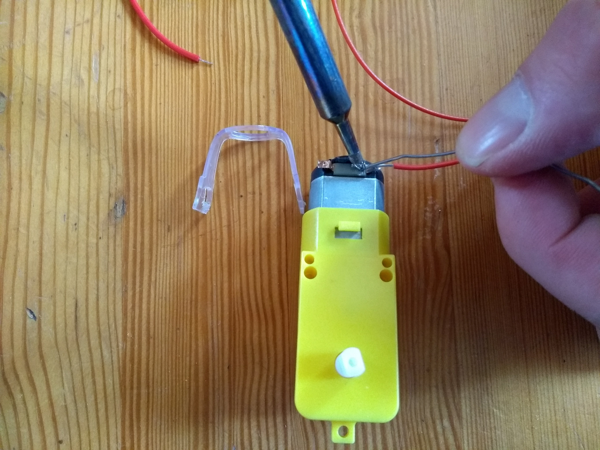

## Assembling the motors and board

The first thing you will want to do is to connect your motor controller board to your Raspberry Pi, the battery pack and your two motors, to test that they are all working.
The instructions here are for L298N Dual H Bridge DC Stepper Motor Driver Controller Board, however they will be pretty similar for most motor controller boards, but you should consult the documentation for your board, if you are using a different one.

### Soldering wires to your motors

Most motors, when purchased, come without soldered wires, so you will need to add these on. If you have never soldered before, then you might like to have a look at out [Getting Started with Soldering](https://projects.raspberrypi.org/en/projects/getting-started-with-soldering)

- Remove the plastic clip from the motor, to make soldering to the contacts easier.

	

- Strip two wires to reveal the metal core.

	
	
- Solder the wires to each of the terminals on the motor. It doesn't matter which wire goes to which terminal.

	

### Connect the board.
