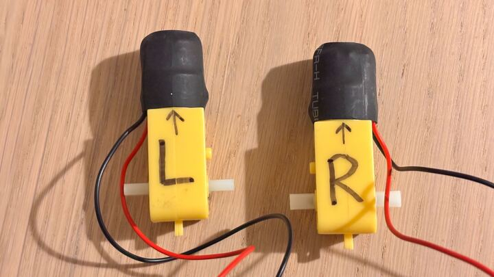

## Left, right, forward, backward

You need to figure out which is your left motor and which is your right motor. You also need to know which way they are driving to go forward, and which way they are driving to go backwards.

--- task ---
Choose one of the motors. Use a marker pen to label it 'right' and draw an arrow on it to indicate which way is forward. Label the other motor 'left' and draw an arrow on it pointing in the same direction as your first one.


--- /task ---

--- task ---
Open **Thonny** from the Raspberry Pi **Programming menu**. 
--- /task ---

--- task ---
Type the following to import the `Robot` class and create a `Robot` object. You can name it anything you like. In this resource, the robot is called `robot`.

```python
from gpiozero import Robot
robot = Robot(left=(7,8), right=(9,10))
```
--- /task ---

--- task ---
Save your file and call it `robot.py` or something similar. 
--- /task ---

--- task ---
Click **Run**
--- /task ---

--- task ---
In the Shell (the bottom window in Thonny), type the following and press <kbd>Enter</kbd>.

```bash
robot.forward()
```

Watch the direction each motor turns.

Stop the motors by typing `robot.stop()`.

<html>
<video width="960" height="540" controls>
<source src="images/motor-test.mp4" type="video/mp4" alt="motors turning">
Your browser does not support the video tag.
</video>
</html>

--- /task ---

--- task ---
Type the following commands, and note which motor changes direction on the second command. 

```bash
robot.forward(0.4)
robot.right(0.4)
```
**Note**: The `0.4` makes the motors go a little slower, so it is easy to see which way they turn.
--- /task ---

--- task ---
The motor that changed direction is the right-side motor. If that was the one you labelled **'right'**, then there's nothing to change yet. If it was the one you labelled **'left'**, you need to alter your `Robot` object in your file to switch around the `left` and `right` pin numbers:


```python
## e.g. change
robot = Robot(left=(7,8), right=(9,10))
## to
robot = Robot(left=(9,10), right=(7,8))
```
--- /task --- 

Now that you have the 'left' and 'right' sorted, make sure you have **forward** and **backward** set up correctly.

--- task ---
Again drive both motors forward.

```bash
robot.forward(0.4)
```

Check that both motors are turning in the direction shown in the diagram below.


If the right-side motor is turning in the wrong direction, alter your `robot` object by switching the order of the GPIO pin numbers. For instance:

```python
## e.g. change
robot = Robot(left=(9,10), right=(7,8))
## to
robot = Robot(left=(9,10), right=(8,7))
```

If the left-side motor is turning the wrong way, then do the same for its pin numbers.
--- /task ---
