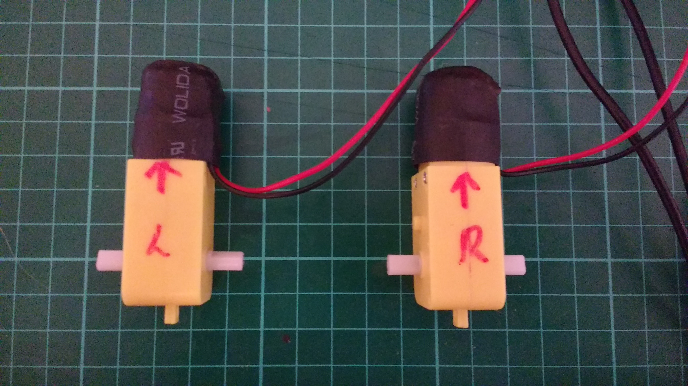

## Left, Right, Forward, Backward

- It is important to know which motor is your left motor and which one is your right motor. You also need to know which way they are driving to go forward, and which way they are driving to go backwards.

- Choose either of the motors. On the motor, use a marker pen to label it as the Right motor and an arrow to indicate which way is forward. On the other motor, label it left and use the same direction for forward.



- Now open a Python shell (`Menu` --> `Programming` --> `Python 3 (IDLE))`

- In the *shell* you can import the `Robot` class and create your `robot`

	```python
	from gpiozero import Robot
	robot = Robot(left = (7, 8), right = (9, 10))
	```
- In the shell you can now type the following, and observe which way the motors slowly turn:

	```python
	robot.forward(0.4)
	```

- Now, type the following command, and note which motor changes direction:

	```python
	robot.right(0.4)
	```
- The motor that change direction is the right hand motor. If that was the one you labelled as **right**, then there's nothing to change yet. If the motor you labelled as **left** changed direction though, you need to alter your `robot` object as shown.

	```python
	robot = Robot(left = (9, 10), right = (7, 8))
	```

- Now that you have the **left** and **right** sorted, you need to make sure you have **forward** and **backward** setup correctly.

- Again, drive both motors forward.

	```python
	robot.forward(0.4)
	```

- Check that both motors are turning in the direction as shown in the diagram below.


- If the right hand motor is turning in the wrong direction, you can again alter your `robot` object, by switching the order of the pins. For instance:

	```python
	robot = Robot(left = (9, 10), right = (8, 7))
	```

- You would do the same to the order of the pins for the left motor, if it is going in the wrong direction.
