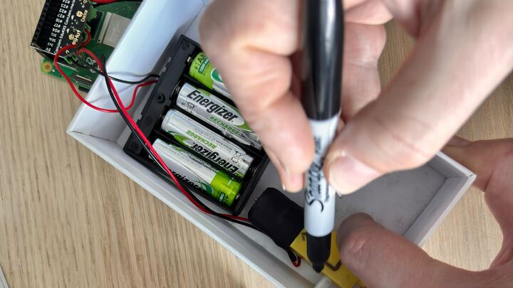
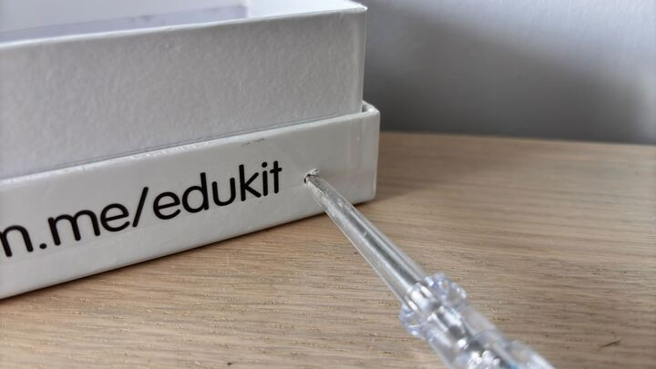
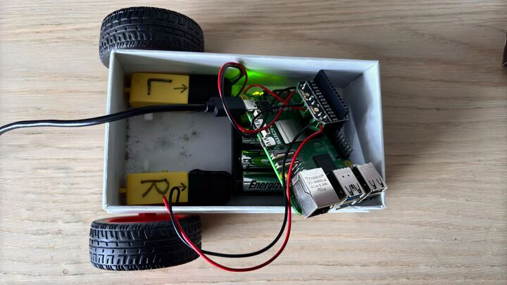
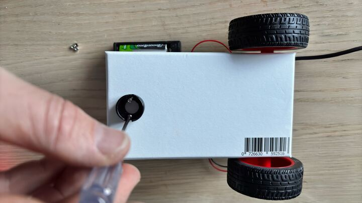
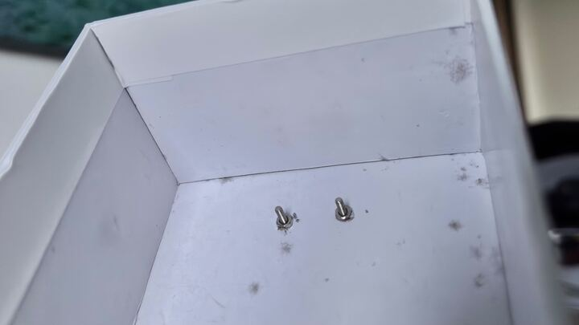
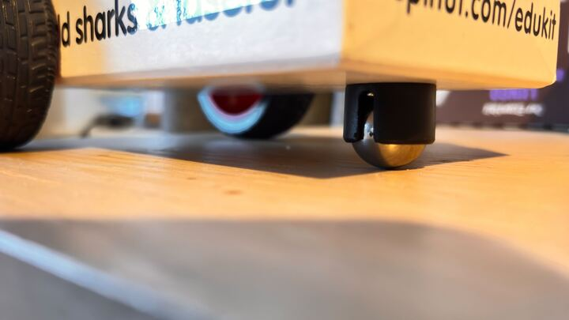

## Assemble your robot

There is no standard way to build your prototype robot chassis, but please note:

- The chassis needs to house the Raspberry Pi, motor controller, and batteries.
- The chassis needs to allow the mounting of a pair of wheels.
- You may want to later add a couple of line sensors, and an ultrasonic distance sensor or a lidar sensor to the chassis.

It's always a good idea to build a prototype chassis first. Eventually, you can learn how to laser-cut or 3D print a chassis, but in this project, a cardboard box is used as a temporary solution.

--- task ---
Position your motors where you would like them to sit in your box. 

Use a pen to mark the place where each motor's axle will pass through the wall of the box. Make sure you are giving your wheels enough room to spin around.

--- /task ---

--- task ---
Poke holes through the sides of the box so that the axles can fit through.

--- /task ---

--- task ---
Attach the wheels to the axles.

You might want to fix the motors in place using an adhesive putty or tape to hold them down.

--- /task ---

--- task ---
Screw a ball caster to the front of the container to act as a third wheel.

--- /task ---

--- task ---
Power up your Raspberry Pi. 

You can use a power bank to give your robot some freedom!

If you want to make your own power bank, then follow the guide below.

[[[generic-electronics-power-bank]]]
--- /task ---

To use your Raspberry Pi without connecting a mouse, monitor, or keyboard, you can remotely access it using [Raspberry Pi Connect](https://projects.raspberrypi.org/en/projects/raspberry-pi-connect){:target="_blank"}.

