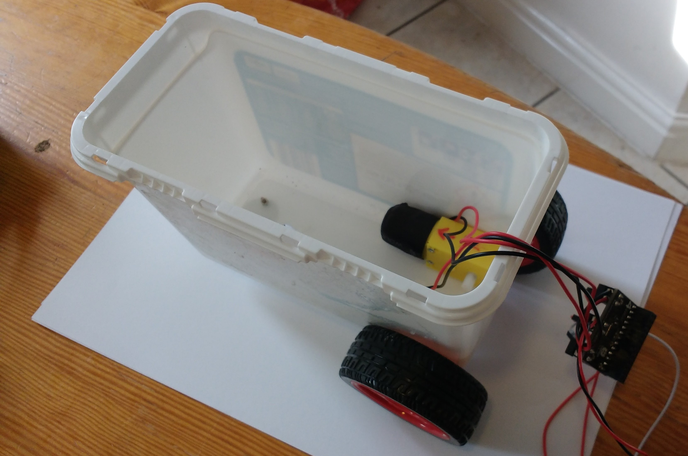

## Assemble your robot

There is no right way to build your robot chassis, but there are a few things to bear in mind. The chassis needs to:

- House the Raspberry Pi and motor controller
- Carry the batteries for the Raspberry Pi and the motor controller
- Allow the mounting of a pair of wheels, the line sensor, and the ultrasonic distance sensor

In this example, we used a washing powder tub, but the instructions can easily be adapted to any type of container or even a monstrous Lego construction.

- First, place your motors into the chassis. 

	
	
- Here, two holes have been cut into the container to allow the motor axles to pass through. 

	

- Make sure you remember which motor is the right-hand one and which the left-hand one. The motors are held in place with a little Blu Tack. You're building a prototype, so you don't want to be glueing anything just yet.

	

- Now the wheels can be attached.

	

- With the wheels in place, a ball caster can be screwed to the front of the container to act as a third wheel. If you don't have a ball caster, you can use another set of wheels or anything that's going to provide as little friction as possible - maybe a table tennis ball that has been cut in half, for instance.

	

- The next step is to wire up the motors to the Raspberry Pi.

	

- You can power your Raspberry Pi using a power brick. At this stage, you're probably going to want to connect to the Raspberry Pi remotely. You can do this via SSH or VNC.

	

[[[rpi-ssh-access]]]
[[[rpi-vnc-access]]]

- If you are using SSH, you can run your program by typing `python3 motor_test.py`.
