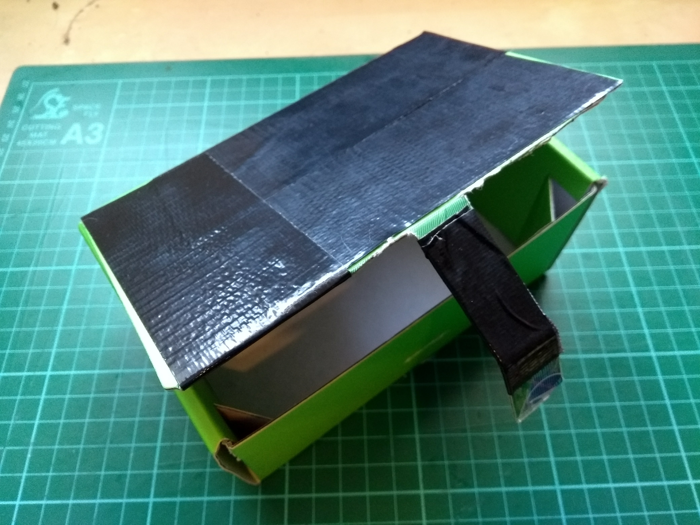
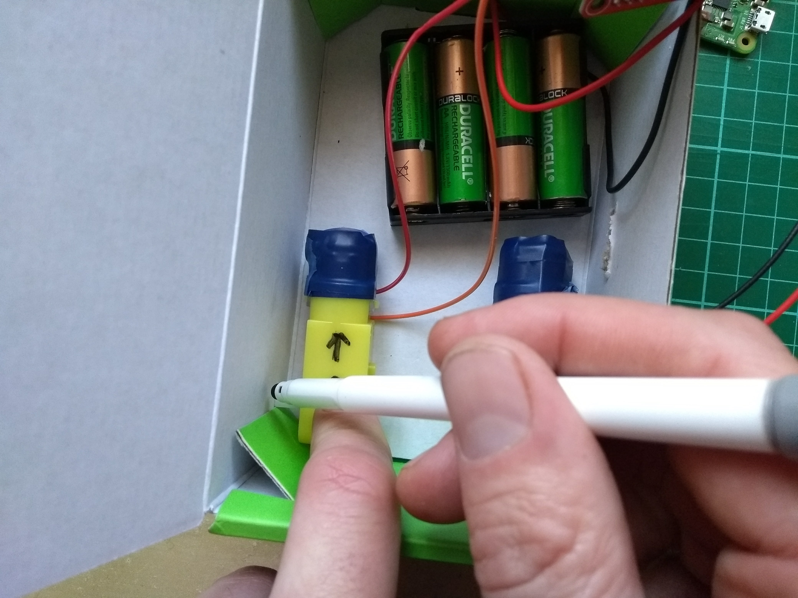
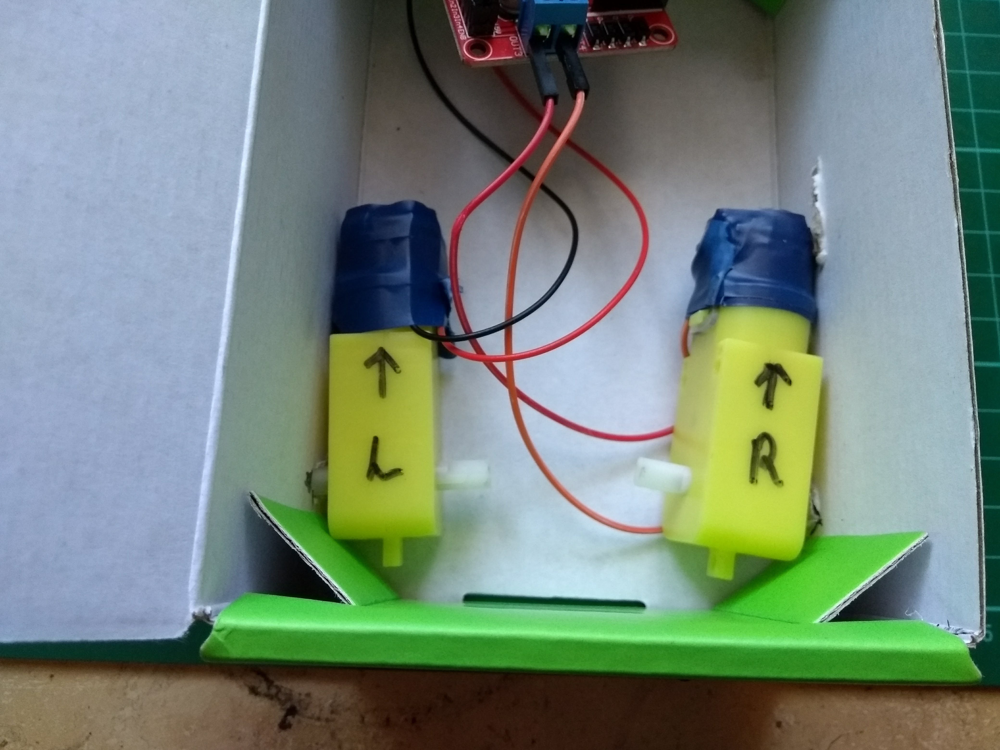
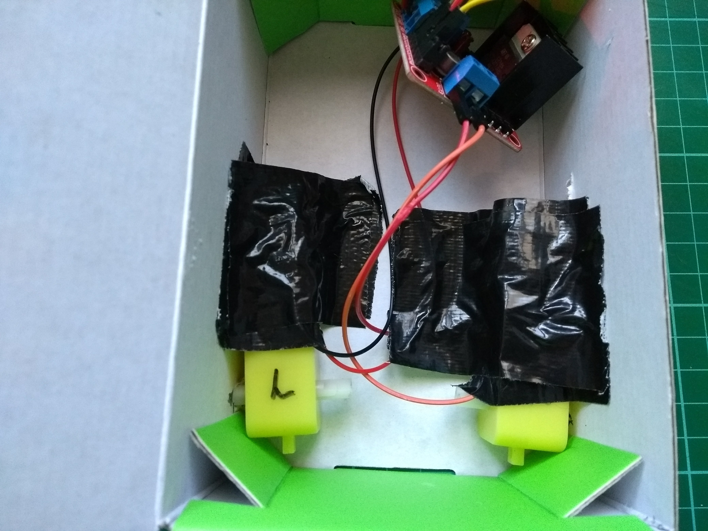
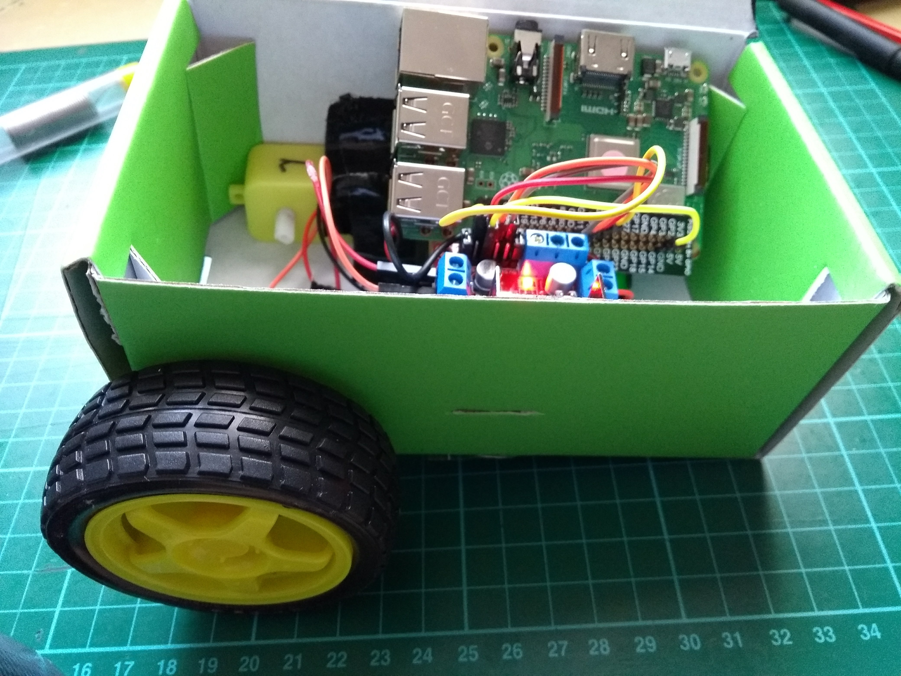
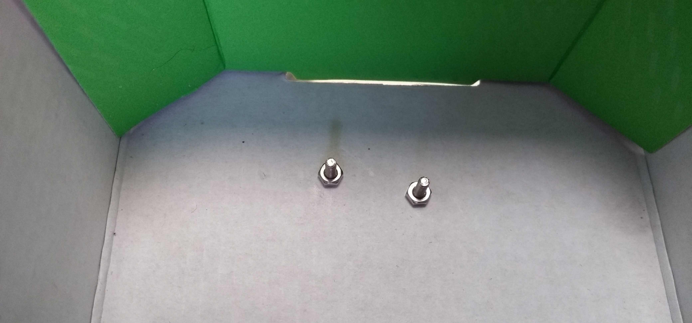

## Assemble your robot

There is no *right* way to build your prototype robot chassis, but there are a few things to bare in mind:

- The chassis needs to house the Raspberry Pi and motor controller.
- The chassis needs to also carry the batteries for the motor controller and the Raspberry Pi.
- The chassis needs to allow the mounting of a pair of wheels.
- You may want to later add a couple of line sensors and the ultrasonic distance sensor or lidar to the chassis.

It's always a good idea to build a prototype chassis first. In a later project, you can learn how to laser-cut or 3D print a chassis, but in this project, a cardboard box is used as a temporary solution.

The first step is to place your motors into the chassis. 

--- task ---
Place your motors inside the box, in roughly the position that you would like them to sit. Then use a pen to mark the place where the motors' axle will need to pass through the walls of the box.

--- /task ---

--- task ---
Use a sharp object to poke holes through the sides of the box, so that the motors' axles can fit through.

--- /task ---

--- task ---
You will need to fix the motors in place. Use an adhesive putty or tape to hold them down.

--- /task ---

--- task ---
Once the motors are in place, you can attach the wheels to the axles.

--- /task ---

--- task ---
With the wheels in place a ball castor can be screwed to the front of the container to act as a third wheel.

--- /task ---

--- task ---
If you're using a power bank, you can now power up your Raspberry Pi. If you are making your own power bank, then follow the guide below

--- /task ---

To use your Raspberry Pi, without connecting a mouse, monitor or keyboard, you can use SSH or VNC to remotely access it.

[[[rpi-ssh-access]]]
[[[rpi-vnc-access]]]

