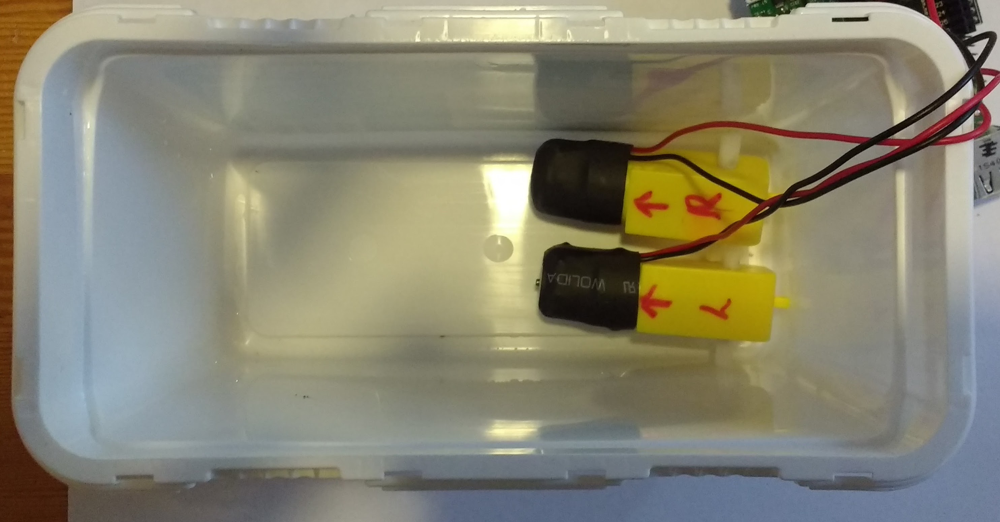
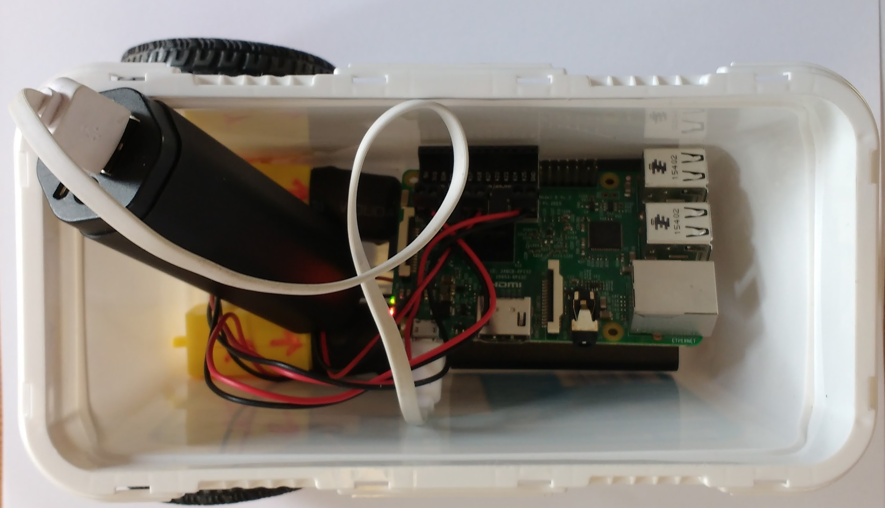

# Building your robot prototype

There is no *right* way to build your robot chasis, but there are a few things to bare in mind:

1. The chasis needs to house the Raspberry Pi and motor controller.
1. The chasis needs to also carry the batteries for the motor controller and the Raspberry Pi.
1. The chasis needs to allow the mounting of a pair of wheels, the line sensor and the ultrasonic distance sensor.

In this example a washing poweder tub was used, but the instructions can easily be adapted to any type of container or even a monstorus Lego construction.


1. The first step is to place your motors into the chasis. 

	
	
1. Here, two holes have been cut into the container to allow the motor axels to pass through. 

	

1. Make sure you remember which is the right motor and which is the left. The motors are held in place with a little blutac. Remember that this is just the prototype, so you don't want to be glueing anything together just yet.

	


1. Now the wheels can be attached.

	

1. With the wheels in place a ball castor can be screwed to the front of the container to act as a thrid wheel. If you don't have a ball castor you could use another set of wheels or anything that's going to provide as little friction as possible. Maybe a ping-pong ball that has been cut in half, for instance.

	

1. The next stage is to wire up the motors to the Raspberry Pi.

	

1. Next you can power your Raspberry Pi using a power brick. At this stage, you're probably going to want to connect to the Raspberry Pi remotely, so that you can still write and edit your code. There are instructions for [remotely working on a Raspberry Pi here.](https://www.raspberrypi.org/learning/teachers-guide/remote/).

	

## Testing your robot

If you're connecting remotely to your Raspberry Pi via VNC, then you can simply run the code you wrote earlier, using IDLE, and then use the shell to control your robot. If you're connecting via SSH, then it's a little trickier. 

1. You should have named your code something like `robot.py`. So in the terminal the first thing you want to do is open a Python 3 shell. You can do this just by typing `python3`.

```bash
pi@raspberrypi:~$ python3
```

1. Now in the Python shell, you can import the code your wrote earlier using the name of the file and the name of your robot.

```python
>>> from robot import remy
```

1. And now you can issue your commands. Here are some examples:

	```python
	>>> ## drive both motors forward
	>>> remy.forward()
	>>> ## drive both motors backwards
	>>> remy.backwards()
	>>> ## Drive the left motor forwards and the right motor backwards
	>>> remy.right()
	>>> ## Drive the right motor forwards and the left motor backwards
	>>> remy.left()
	>>> ## Stop both motord
	>>> remy.stop()
	```
	
1. Test out your robot's controls, and have a little fun with your remote controlled robot.

## What Next?

Now that you have a working robot, it's time for it to start sensing the environemnt. Have a go at one go the following activities, to give your robot a little intelligence.

1. Programming your buggy to avoid obstacles
1. Programming your buggy to follow a line
1. Programming yout buggy to use a Wiimote
1. Programming your buggy to do everything
