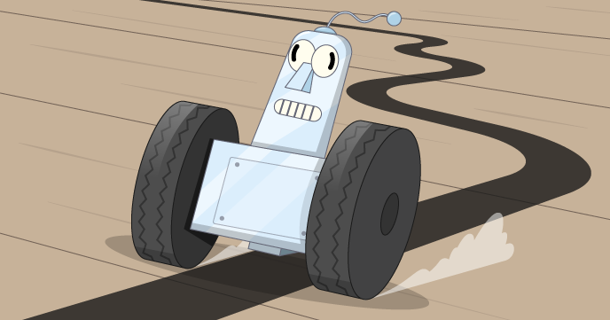

## What can you do now?

Try our [Build a line-following robot](https://projects.raspberrypi.org/en/projects/rpi-python-line-following/) project pathways where you will make your robot follow a path.

--- print-only --- 

--- /print-only ---

--- no-print ---

<video width="640" height="360" controls>
<source src="images/showcase.webm" type="video/webm">
Your browser does not support WebM video, so try FireFox or Chrome.
</video>

--- /no-print ---

If you want to have more fun exploring Python, then you could try out any of [these projects](https://projects.raspberrypi.org/en/projects?software%5B%5D=python){:target="_blank"}.